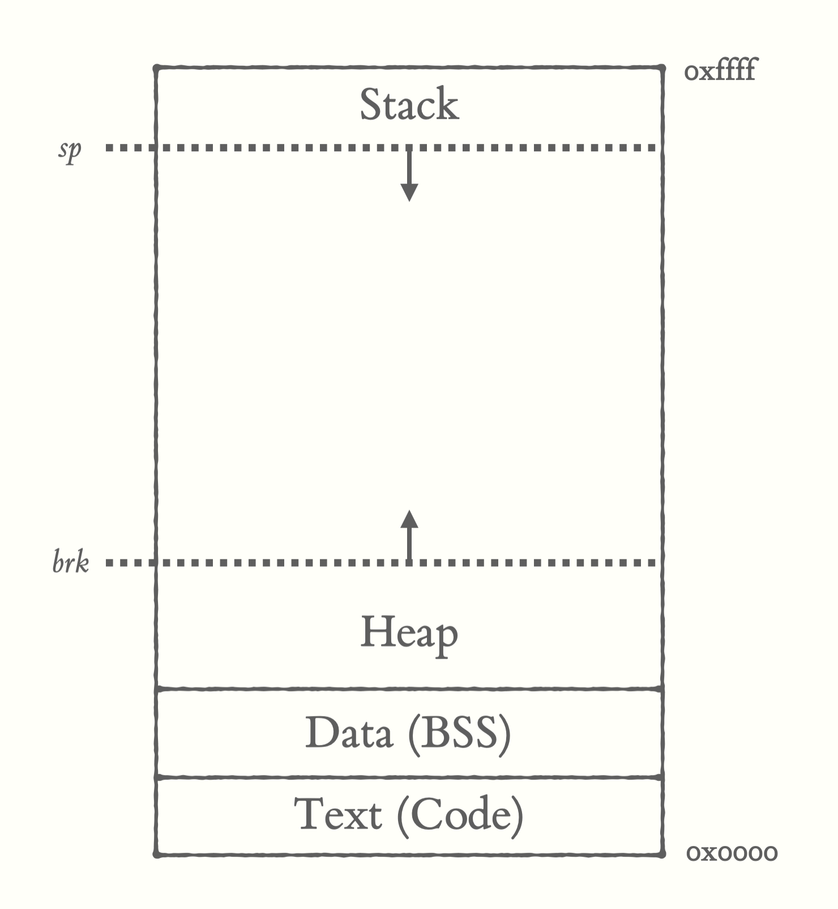

# v2

v2 refactors to a unified memory layout. Instead of using separate js arrays for each segment,
all segments (code and memory) are now in one big Int32Array. 

Pointers such as `sp` (stack pointer) and `rsp` (return stack pointer) are used to implement our stack behavior.




Now that we have a data (bss) segment, we can store statically initialized data like strings. We're using `utf32be()` from customasm
to create static strings. You can use normal labels to address them. It's best to put these after your code but they could probably go anywhere
where code isn't going to be jumped to (e.g. in between 2 subroutines). See the [hello world](asm/hello_world.asm) program as an example:


```asm
#include "smol.asm"

; takes the address to the string on the stack
print_str:
  ; we are looping and loading the byte at the address
  ; we `emit` the byte to the screen and incrememnent to the next address
  .loop:
    dup
    load 
    dup
    emit
    swap
    push 1
    add
    swap

    ; the last character is now on
    ; top of the stack, we jump back to loop
    ; if it's not zero
    jnz .loop

  return

_start:
  ; push the address to the string onto stack
  push hello_world_string
  call print_str

  ; newline
  push 10
  emit 

  halt
    

hello_world_string:
  #d utf32be("Hello World!\0") ; c-style null termination tells us where the end of the string is
```


```bash
customasm v2/asm/hello_world.asm -o v2/bin/hello_world.smol
customasm v2/asm/guess.asm -o v2/bin/guess.smol

node v2/vm.js v2/bin/hello_world.smol
# => Hello World!
# => 


node v2/vm.js v2/bin/guess.smol
#=> Input Guess: 1
#=> Incorrect! Try again!
#=> Input Guess: 4
#=> Incorrect! Try again!
#=> Input Guess: 7
#=> Correct!
```

